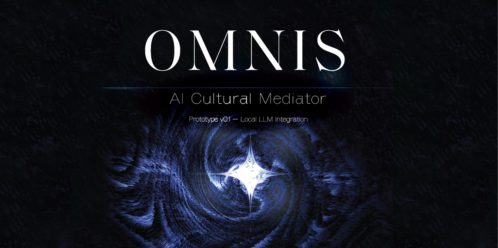

# OMNIS

<p align="center">
  
</p>

## AI Cultural Mediator

**Prototype v0.1 — Local LLM Integration**

> *A Unity prototype demonstrating local Large Language Model (LLM) integration using Ollama as the technical foundation of the OMNIS project.*

---

## About

OMNIS is an early-stage Unity prototype created to establish a communication pipeline between Unity and a locally hosted Large Language Model (LLM).

Rather than being a complete application, this version focuses on validating the technical foundation required for future AI-assisted interactive experiences.

The project currently demonstrates local inference through Ollama, configurable system prompts, and a modular architecture designed for future expansion.

---

## Current Capabilities

- Local LLM integration with Ollama
- Unity ↔ LLM communication
- Configurable model selection
- Configurable endpoint
- Dedicated system prompt architecture
- Modular code structure
- Local execution without cloud services

---

## Technology Stack

- Unity 2022
- C#
- Ollama
- Qwen2.5 3B
- TextMeshPro
- .NET HttpClient

---

## Project Status

🚧 **Research Prototype**

Version

```
v0.1.0
```

Current Focus

> Establishing a reliable Unity ↔ Local LLM communication pipeline.

---

## Future Direction

OMNIS is designed as a long-term research project exploring how AI can support interactive cultural experiences.

Future versions may include:

- Conversation memory
- Retrieval-Augmented Generation (RAG)
- Knowledge bases
- XR integration
- Digital cultural heritage applications

---

## Author

**Aylar Fakherian**

Human-Centred Design • Interactive Systems • Digital Cultural Heritage
